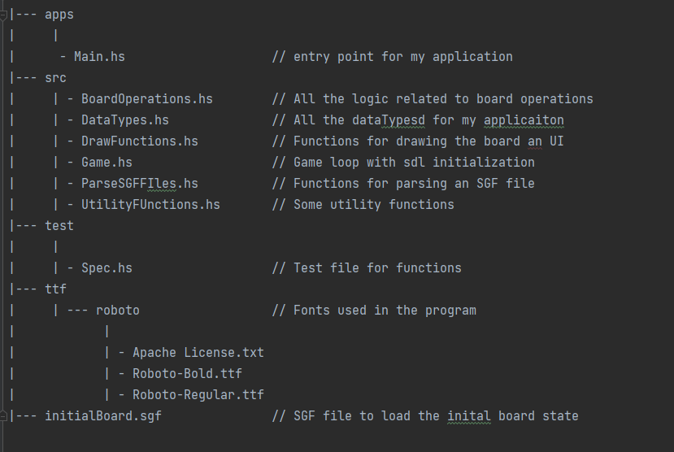

# prog2006-assignment-1

## How to build and run the project

### You need to have these already installed
* GHC with stack
* SDL2
* SDL2-ttf
* SDL2-dev

### How to run the program
You first need to clone this git repository onto your computer using "git clone 'repository link'". The repository link is found by clicking the 
Clone button in the gitlab repository for this project and then copy the https link. Then you need to move to the root directory of the project
and then to both build and run the project use the command Stack run:
````Stack run````
### Important notice
The Program as it is right now will crash if you try to run the program using 'Stack run' and the sgfFile is not in place
There is already a sample sgf file in the project structure, feel free to add moves, or change the size of the board as you wish. 
Right now the only way to change the size of the board is through using the sgf file and changing the number in the "SZ[]" field.

### How to play the game
For placing a stone on the board you simply use the mouse and click on the square where you want to place the stone. One simplification I have
used is that the stone is placed in the middle of the square and not on the intersections between the squares, like it is in the standard GO game.
The stones palced will alternate between black and white. You can read the rules of the game and how it works here: https://en.wikipedia.org/wiki/Go_(game)
I have implemented: captures, ko-rule (not allowing duplicate bord states), komi for white player, suicide moves are not allowed and there is a scoring system
that can be changed between: Areascoring and TerritoryScoring (Tried to let the user decide at the start of the game, but it did not work, must be changed manually, in the mainApp funciton)

## Project Structure


## Requirements Specification
### Mandatory requirements by the User: The program must be able to:
* Visualize the game board for the user with the stones 
* Update the board with the new stones for each move (alernating color)
* Correctly capture any groups or stones that do not have any liberties
* Never allow Illegal moves such as (Placing on an opponent stone and suicide moves)
* Load the board state from an SGF File
* Keep track of the game state
* Black Stone should make the first move (excpetion if it played last in the SGF file)
* Not crash unintentionally 

### Requirements that should be implemented to improve the game:
* Let the user place the stones using the mouse (not command line)
* The interface should be resizable
* Allow the user to pass their turn
* Have an undo function, so the user can revert to the previous board state
* The Board and stones should have textures
* Have a scoring system for the game and decide the winner when both players pass
* Enforce the Ko Rule
* Have options to make computer generated moves such as eliminate most amount of stones
* Be able to determine of two board states are isomorphic

### Requirement assumptions by the developer:
* The drag and drop feature must not be implemented and clicking on the desired board coordinate is sufficient
* The stones can be rendered using only SDL and not textures using SDL-Image
* The stones do not have to be perfectly round 
* The coordinate system will be implemented with (0,0) being the top left corner
* The Path to the sgf file will be provided and the user must change the existing sgf file
* The stones must not be placed at the intersections of the board lines, but can be placed at the center of the squares
* The computer generated moves will use exhaustive search patterns to find the best moves.

## Non-Functional Requirements
1. Usability:
    * It should be intuitive and easy for the user to use the applications features. 
2. Performance:
    * The program should react quickly to user actions, not be slow and hard to interact with and have low response times
    * The program should not use a large load of the users CPU power and memory space
3. Security:
    * The program should not introduce any security risks for the user
4. Maintainability:
    * The codebase should be easy to maintain by having:
    * Well commented functions.
    * Good modularity to navigate the codebase easy
    * Documents explaining key components of the program
5. Compatability:
    * The program should be able to operate regardless of what operating system you are using, as long as you have the correct installations (For example GHC and SDL for this project)
6. Scalability: 
    * The program Should be structured such that it is easy to implement new features and scale the project.


## Self-Assessment

### Non-funcitonal Requirements
1. Usability:
    * The application is easy and intuitive to use and provides a UI, so the user knows the available options
2. Performance:
    * The program responds quickly to mouse interactions, however it can be slow with the computer generated moves because they utilize exhaustive searches.
    * Useing the key features of the program does not provide any problems for the CPU or memory capacity. However, as stated above the computer generated moves can cause trouble in regrads to performance 
3. Security:
    * The program does not introduce any security issues to the users computer
4. Maintainability:
    * The codebase:
    * Has well commented functions
    * Divides the code into logical parts that belongs together, so it is easier to navigate
    * Has a readme file with documentation for the project
5. Compatability:
    * The program can be run on different operating systems as long as the required installations are present on the users computer
6. Scalability:
    * The data types for this program could have been structured and refactored even better such that the code would be easier to scale

### Functional requirements:
The program has all implemnted all the "must have" features listed in the requirement specification:
- [x] Visualize the game board for the user with the stones
- [x] Update the board with the new stones for each move (alernating color)
- [x] Correctly capture any groups or stones that do not have any liberties
- [x] Never allow Illegal moves such as (Placing on an opponent stone and suicide moves)
- [x] Load the board state from an SGF File
- [x] Keep track of the game state
- [x] Black Stone should make the first move (excpetion if it played last in the SGF file)
- [x] Not crash unintentionally 

The features implemented in the requirements that would "improve the program":
- [x] Let the user place the stones using the mouse (not command line)
- [ ] The interface should be resizable
- [x] Allow the user to pass their turn
- [x] Have an undo function, so the user can revert to the previous board state
- [ ] The Board and stones should have textures
- [x] Have a scoring system for the game and decide the winner when both players pass
- [x] Enforce the Ko Rule
- [x] Have options to make computer generated moves such as eliminate most amount of stones
- [ ] Be able to determine of two board states are isomorphic

### Reflection

First I have to address the elephant in the room. When working on this project I completely forgot to use the git repository 
in my workspace. This is a BIG issue and should not have happened, I know this makes the project 
look very unprofessional, and I am very mad at myself for forgetting this. Specially since I did this very professionally in 
the Graphics course last semester. I tried to simulate how the commits roughly could have looked like, but they were as said, 
done after the program was actually written. 

This project was very time-consuming for me. This was a result of the functional style of Haskell being very different from the 
programming languages I was familiar with. Additionally, I spent a lot of time getting everything with SDL to work. I tried so many times
to get the SDL-Image to work, but it simply would not work for me. Therefore, I had to draw the circles using SDL and could not use textures
for my program.

The code for filling the stones with color only using SDL and not textures from SDL-Image, proved to be a real challenge. I struggled a lot and
was not able to do it entirely on my own. I needed to get the visual representation of the stone completed because it helps a lot when testing the
program. I ended up asking ChatGPT to help me implement this code. It never gave me fully working code that adhered to my implementation, but it helped
me understand how it could be implemented, using this help I was able to implement the code for filling a circle.

I am quite pleased with the end result of the actual program and the functionalities it has. On the other side the data structures I use for my 
game are not optimal. This should have been refactored earlier, and as a consequence it is harder to expand the program with implementing new
functionalities. This is because a lot more parameters have to be passed around, when I do not have a 'World' datatype. The way I am handling 
events works fine as of now because there are not so many, but it is not very idiomatic, and would probably need refactoring if many more 
events were needed. I Will definitely look to improve these two points for the portfolio delivery.


